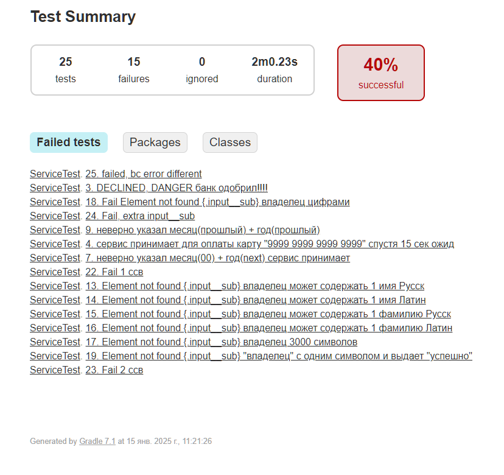

# Отчет о тестировании веб-сервиса для приобретения путевок

## Краткое описание

05.12.24 - 07.12.24 было проведено автоматизированное тестирование веб-сервиса для приобретения путевок с онлайн-оплатой или оплатой в кредит.
В ходе проверки были проведены тесты UI, тестирование записи в БД.

## Описание процесса тестирования

После получения SUT было проведено исследовательское тестирование с использованием техник эквивалентного разделения и граничных значений.  
В ходе этого этапа был протестирована сама форма ввода, БД.
Перед началом автоматизации был разработан план автоматизации.

### Тестовые данные:

В качестве тестовых данных использовались данные, предоставленные разработчиком (номера и статусы карт), для остальных данных использовалась автоматическая генерация, ручной ввод.

### Тестирование производилось в следующем окружении:

Win 11 64 bit  
Версия Java 11.0.11

### Тестирование:

Всего было проведено 25 тестов, из них 15 тестов закончились неуспешно, что составляет 60% от общего количества.
Выявленные дефекты были отражены в [Issue](https://github.com/alexthomson031/DiplomQARef).

### Общие рекомендации:
1. Устранить обнаруженные дефекты
2. Добавить CSS селекторы для тестирования
3. Разработать документацию на БД.
4. Установить валидацию полей при передаче данных в БД.